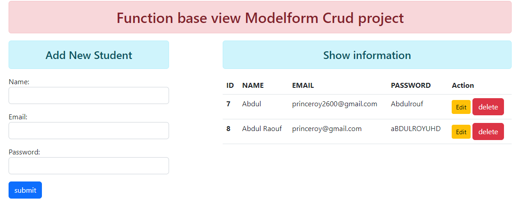

# Django CRUD Project

This Django CRUD project is a simple web application that allows you to perform basic CRUD operations (Create, Read, Update, Delete) on a specific resource (e.g., items, posts, users). This README provides an overview of the project and instructions for setting it up and running it locally.
#  Display
  
## Features

- Create new items.
- Read and display existing items.
- Update and edit items.
- Delete items from the database.
- User-friendly web interface.

## Usage

   Create: Use the "Create" functionality to add new items to the database.
   Read: The "Read" functionality allows you to view a list of existing items.
   Update: Edit and update items using the "Update" functionality.
   Delete: Remove items from the database using the "Delete" functionality.
   
## Prerequisites

Before you begin, ensure you have met the following requirements:

- Python 3.x installed on your system.
- Django installed (you can install it using `pip install Django`).

## Getting Started

To get started with this project, follow these steps:

1. Clone this repository to your local machine:

   ```shell
   git clone https://github.com/Princeroy1/Django-Crud-


    # Run the following commond:

   pip install -r requirements.txt
   python manage.py migrate

   # Create a Superuser by executing the following command:
   python manage.py createsuperuser


  #run project
  python manage.py runserver
